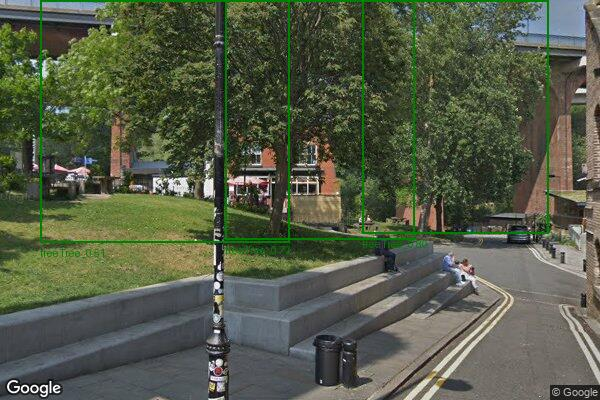
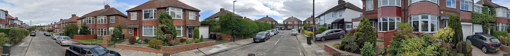
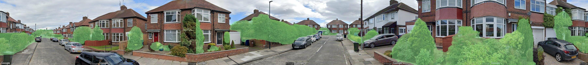

# Urban Tree and Temperature Analysis

This project provides tools for analyzing urban trees and temperature data using satellite and street-level imagery, as well as historical weather data. The workflow includes extracting coordinates, downloading images, detecting trees, and generating temperature heatmaps and statistics.

## Features

- Extracts coordinates from addresses or street names.
- Downloads Google Street View and aerial images for specified locations.
- Detects trees in images using YOLO-based models.
- Generates temperature heatmaps and statistical summaries using historical weather data.
- Produces visualizations such as trend plots and seasonal distributions.

## Project Structure

```
.
├── Assets/                      # Project images and assets
├── config.yaml                  # Configuration file (API keys, directories)
├── coordinates.yaml             # List of coordinates and addresses
├── main.py                      # Main pipeline script
├── Temp_comp.py                 # Temperature data processing and visualization
├── coordinate_to_images.py      # Downloads images for coordinates
├── street_to_coordinate.py      # Converts street names to coordinates
├── tree_detection.py            # Tree detection logic
├── segment_the_trees.py         # Tree segmentation
├── segment_the_vegetation.py    # Vegetation segmentation
├── heatmap.py                   # Heatmap generation
├── requirements.txt             # Python dependencies
├── README.md                    # Project documentation
└── ...
```

## Example Workflow

1. **Configure the Project**  
   Edit `config.yaml` to set API keys and output directories.

2. **Extract Coordinates**  
   Use [`street_to_coordinate.py`](street_to_coordinate.py) to convert addresses to coordinates and save them in `coordinates.yaml`.

3. **Download Images**  
   Run [`coordinate_to_images.py`](coordinate_to_images.py) to download street view or aerial images for each coordinate.

4. **Detect Trees**  
   Use [`tree_detection.py`](tree_detection.py) or `main.py` to detect trees in the downloaded images.

5. **Analyze Temperature Data**  
   Run [`Temp_comp.py`](Temp_comp.py) to fetch historical temperature data, generate heatmaps, and create statistical summaries.

## Outputs

- **Heatmaps**: Interactive HTML heatmaps of average temperatures.
- **Trend Plots**: PNG images showing yearly and seasonal temperature trends.
- **CSV/JSON**: Detailed temperature statistics and raw data.

## 🖼️ Visual Results

### 🌳 Street View Image


### 🌳 Street View Images (Tree Detection)


### 🌇 Combined Panorama


### 🌇 Combined Panorama Segmented


### 🌇 Satellite Imagery


### 🌇 Satellite Imagery (Aerial Tree Detection)


### 🌡️ Temperature Trends


### 📊 Seasonal Statistics


## Requirements

- Python 3.11
- See [`requirements.txt`](requirements.txt) for dependencies.

## Running the Pipeline

```sh
python main.py
```

Or run individual scripts as needed.

## License

This project is for research and educational purposes.

---
## 👨‍💻 Author

**Harshit Chaudhary**

[LinkedIn](https://www.linkedin.com/in/harshit-chaudhary-ai-quant/) | [GitHub](https://github.com/Harshit-Chaudhry)

---

*For questions or contributions, please open an issue or pull request.*